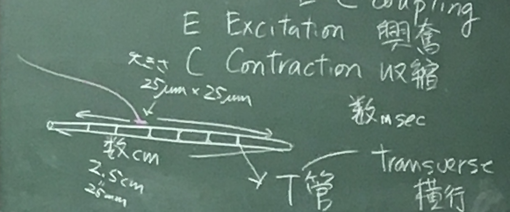
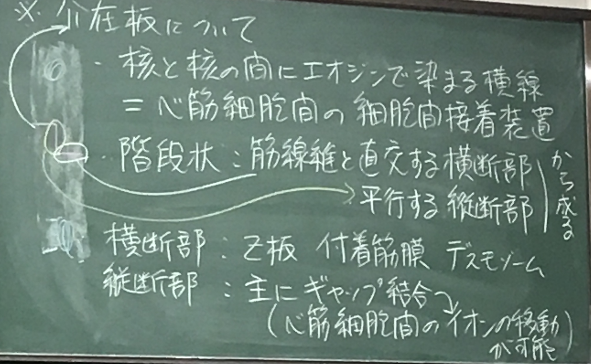

注：筋は4/17に実施した範囲も本ノートに記載。  
注：Markdownで記載しており、番号表記がビューワーによって異なる可能性あり。

##### 要点
* 組織の染色法：　HE染色では何が染まるのか
* 上皮組織の分類
* apical面（頂上面）、basolateral面（側底面）の特殊な分化
* 部分分泌の分類とその終末部の組織像の遅い
## 組織学とは

組織の内部構造の観察を主とする学問

> 	* 肉眼 0.1mm = 100μm ＞　細胞　〜　100μm
> 	* 顕微鏡 解像度 400nm ＝　光の波長（400〜800nm）/ 開口数1.5 ＞　ウイルス

1. 切片を作る：　薄く切る　「薄切」
	* 樹脂（パラフィン、セロイジン）などを浸透させる　→ 切る
	* 凍らせる

1. 防腐（＋固くする）　「固定」
	* ホルマリン（パラホルムアルデヒド）

1. 無色透明なので染める　「染色」
	* 染色法　ヘマトキシリン・エオジン染色（HE染色、Hematoxylin Eosin） 
		* ヘマトキシリン（紫色）：　塩基性色素　酸性の構造物を染める。核酸（DNA, RNA）
		* エオジン（ピンク色）：　酸性色素　塩基性の構造物を染める（タンパク質）

	* 好酸性物質　≒ エオジンでよく染まる basophil
	* 好塩基性物質　≒ ヘマトキシリンでよく染まる

## 組織

４種類に大別される総論でこれらを説明する。どのような臓器でもこの４種類の組み合わせで構成される。

* 上皮組織
* 支持組織（結合組織）
* 筋
* 神経

### 上皮とは

体の表面・管腔（消化器、呼吸器、泌尿器の内腔）、体腔（心膜腔、胸膜腔、腹膜腔）などの表面を覆う、１〜数層の細胞層

* 特徴：　細胞同士が密着している　＝　細胞間質が少ない
（反対に細胞間質が豊富　→ 支持組織）
* ほとんどの内分泌線、外分泌腺は、上皮が落ち込んでできたもの
* 感覚器（視覚、聴覚、平衡覚など）、毛、爪、水晶体なども上皮に由来する構造物「上皮性」
	* 内皮：　体液（血液・リンパ）に接する上皮（血管内皮など）
	* 中皮：　体腔に接する上皮

#### 上皮組織の分類

1. 単層上皮：　１層の上皮細胞からなる
    1. 単層扁平上皮：　扁平な単層上皮（血管内皮など）
    1. 単層立方上皮：　高さと幅がほぼ同じ（腎の尿細管上皮など）
    1. 単層円柱上皮：　丈の高い単層上皮（腸の粘膜上皮など）
1. 重層上皮：　数層の上皮細胞が重なってできる。
	1. 重層扁平上皮：　扁平な細胞が数層重なってできた上皮（実際は表層の細胞は扁平だが、深層は立方の円柱状が多い、表皮、口腔、食道上皮など）
	1. 重層立方上皮：　汗腺の導管など
	1. 重層円柱上皮：　円柱状の細胞が重なったもの。（目の結膜円蓋、尿道の一部、軟口蓋上面）
1. 偽重層上皮（多列上皮ともいう）：　細胞一層だが、細胞の丈の高さが異なり、核の高さがまちまちにみえる。（鼻腔、気管、精管など）
1. 移行上皮：　状態に応じて形態が移行する上皮（泌尿器系：　腎盂、腎杯、尿管、尿道上皮など）

#### 上皮の頂上面（apical面）と外側面（lateral面）の分化について

##### 上皮細胞の頂上面

* 線毛、微絨毛が見られることが多い。

|  | 線毛（運動線毛） | 線毛（一次線毛） | 微絨毛 |
| :---: | :---: | :---: | :---: |
| 芯 | 微小管 | 微小管 | アクチン線維 |
| 分布 | 気管・卵管 | 腎臓・神経等に広く分布 | 腎臓・小腸など |
| 数 | １つの細胞に多数 | １つの細胞に１本のみ | １つの細胞に多数 |

##### 外側面（lateral面）

* 接着複合体がよくみられる（接着複合体　＝　密着帯＋接着帯＋接着斑）

| Tight junction | Adherens junction | desmosome |
| :---: | :---: | :---: |
| apical寄り（上） | ↔︎ | （下） | 
| occludin, caludin 上皮の上下の物質の交通を防ぐ | cadherin | desmoglein（cadhelin様分子） |
| ベルト状 | 同左 | パッチ状に局在 |

* ヘミデスモソーム（半接着斑）
	* 上皮組織の最下層の細胞にあり、上皮組織とその下の結合組織をつなぐ
* ギャップ結合
	* 心筋、平滑筋細胞、ある種の上皮細胞、内分泌細胞の細胞間にある
	* 細胞膜間の著しく狭い部位に存在する
	* コネキシンタンパク質が６個集まってコネクソンという穴を形成  
	→ その穴を通して、細胞間の興奮伝達や物質（イオン等）の交流が行われる

#### 腺について

* 通常は腺細胞が集団を成して、分泌機能を営む
	* 腺細胞：　細胞内で特定の物質を合成し、細胞外に放出する細胞。上皮由来のものが多い。

* 上皮内腺：　上皮の中に単独に存在する腺　（ex. 杯細胞）
* 上皮外腺：　上皮から外れて結合組織に陥入して、腺組織を形成し、分泌機能を営むもの
	* 内分泌腺：　腺組織が元の上皮と導管によって連絡し、分泌物が導管を通って上皮の方に向かうもの
	* 外分泌腺：　腺組織と元の上皮の間に全く連絡がなくなり、分泌物が血管やリンパ管に分泌されるもの
		* 全分泌
		* 離出分泌
		* 部分分泌
			* 漿液性
			* 粘液性
			* 混合性

外分泌腺（部分分泌）の構造

##### 部分分泌の分類（終末部の形態による粘液性）

| --- | 漿液性 | 粘液性 |
| :---: | :---: | :---: |
| 分泌物 | 主に酵素 | 粘液（糖タンパク質のムチンが主） |
| 核 | 丸く細胞の中央〜基底寄り | 扁平、基底側に強く押し付けられる |
| 細胞質 | タンパク質が豊富　→エオジンで赤く 基底部のmRNA, rRNAがヘマトキシリンで染まることもある | HEなどの色素に染まりにくい（無色） | 
| 例 | 膵臓、胃、耳下腺 | 舌下腺、顎下腺、消化管、気管など |

* 混合性：　粘液性と漿液性が混在する（舌下腺、顎下腺など）
* 漿液半月

# 筋組織

* 要点
	* サルコメアの構造
	* 細いフィラメント、太いフィラメントの構成成分
	* 筋肉（骨格筋）の収縮の分子機構
	* 骨格筋、心筋、平滑筋の構造の違い

* 筋組織の種類は３つ
	* 横紋筋
		* 骨格筋
		* 心筋
	* 平滑筋

## 骨格筋について

横紋を持ち、強力、迅速な収縮ができる

* 筋線維　＝　筋細胞
	* 巨大な１個の柱状の細胞（太さ20〜100μm、長さが数cm）、枝分かれは稀。
	* ミトコンドリア多い　→ ATP産生
	* 筋線維の中　＝　筋原線維　＋　その間を満たす細胞質（筋形質）
	* 核：　円板〜楕円板状
	* 筋線維の周縁部におしやられている。
	* 多核
	* 筋内膜（＝１つの筋線維）　＜　筋周膜（数個の筋線維）　＜　筋上膜（＝筋膜）（筋肉全体）
	* 筋内膜は結合組織であり、細胞膜ではない

* 筋原線維
	* 横紋がみられる。
	* 筋原線維の基本単位　→ サルコメア（筋節）
	* サルコメアは細いフィラメントと太いフィラメントからなる

* 細いフィラメント：　太さ7nm, 長さ1μm
	* 主にアクチン線維＋３つのタンパク
		1. トロポミオシン：　長いタンパク質、アクチン・トロポニンと結合
		1. トロポニン：　I,C,Tの複合体
			* I: 結合を妨げる
			* C: Ca2+と結合
			* T: 複合体を1に結合
		1. ネブリン：　細いフィラメントに沿って走り、Z板に付着。アクチン線維の長さを決める。

* 太いフィラメント：　太さ15nm, 長さ1.5μm
	* ミオシンとタイチンからなる
		* ミオシン　＝　重鎖＋軽鎖
			* 重鎖：　球状の頭部＋尾部から成る、ATP、アクチン、軽鎖に結合
		* タイチン（コネクチン）：　非常に大きい（Z板〜M線）、筋が伸ばされた後、ミオシン線維を元に戻す

### E・C coupling（興奮・収縮連関、Excitation/Contraction）

* T管（transverse：横行）が細胞を貫通（細胞膜の管）。各サルコメアのA・I結合部の周囲をとりまく  
→両脇に筋小胞体（滑面小胞体）。膜構造が３つ連なった３つ組（triad）をつくる

* 神経刺激により、筋にNa+が流入し、筋細胞膜が脱分極  
↓ T管を伝わる
* T管上のL型電位依存性カルシウムチャネル（VDCC）が構造変化  
↓
* 3つ組を介した直接的な相互作用により、筋小胞体上のリアノジン感受性Ca2+チャネルが開く  
↓
* 筋小胞体から筋細胞質へCa2+放出  
↓
* Ca2+がトロポニンCに結合  
↓
* トロポニン、トロポミオシン複合体の立体配置が変化  
↓
* ミオシン頭部がアクチンフィラメントに結合し、ATPを分解  
↓
* ミオシン分子の頭部の変位を起こして、アクチンを引っ張る  
↓
* サルコメアが短くなる

## 心筋について

骨格筋との形態の違い

| --- | 心筋線維 | 骨格筋線維 |
| :---: | :---: | :---: |
| 大きさ | 小（長さ 70〜90μm、太さ 10〜20μm） | 大（長さ　数cm、太さ　20〜100μm） |
| 筋線維の形 | 円筒形、網状に分岐 | 巨大な１個の柱状、分岐しない |
| 核 | １〜２個の線維の中央、長円形 | 多核、線維辺縁、円板〜楕円板状 |
| 介在板 | あり | なし |

細胞内微細構造の違い

| --- | 心筋線維 | 骨格筋線維 |
| :---: | :---: | :---: |
| T管の部位 | Z板の周囲 | A・I接合部 |
| 筋小胞体 | 発達悪い | 発達良い |
| 見え方（T管と筋小胞体） | ２つ組 | ３つ組 |
| ミトコンドリア | 非常に多い（→エネルギー産生活発） | 心筋よりは少ない |

#### 介在板について

核と核の間でエオシンで染まる横線　＝　心筋細胞間の接着装置
* 階段状：　筋線維と直行する横断部、平行する縦断部から成る
	* 横断部：　Z板・付着筋膜、デスモソーム
	* 縦断部：　主にギャップ結合（細胞間のイオン移動可）

## 平滑筋について

消化器、呼吸器、生殖器の壁や脈管壁に層をなして分布

骨格筋との形態の違い

| --- | 平滑筋線維 | 骨格筋線維 |
| :---: | :---: | :---: |
| 大きさ | 小（長さ 20〜200μm、太さ 5μm前後） | 大（長さ　数cm、太さ　20〜100μm） |
| 細胞の形 | 細長い紡錘形、分岐なし | 巨大な１個の柱状、分岐なし |
| 核 | １個、細胞中央、棒状〜紡錘状 | 多核、線維辺縁、円板〜楕円板 |

収縮機構の違い

| --- | 平滑筋線維 | 骨格筋線維 |
| :---: | :---: | :---: |
| ギャップ結合 | あり | なし |
| T管系 | カベオラ（細胞膜のΩ型陥入） | T管 |
| 筋小胞体の発達 | 悪い | 良い |
| サルコメア構造 | なし | あり |
| アクチン線維の結合部位 | 暗調小体 | Z板 |
| トロポニン | なし（とロボミオシンはある） | あり |
| Ca2+の流入 | 細胞外から細胞質へ | 筋小胞体から細胞内 |
| Ca2+の感知 | ミオシン軽鎖キナーゼ | トロポニンC |

#### 収縮の流れ
* 平滑筋の細胞質のCa2+↑  
→ カルモジュリンに結合  
→ ミオシン軽鎖リン酸化  
→ ミオシンのアクチン結合部位が露出（骨格筋と逆）  
→ 結合  
→ 収縮

> 骨格筋、平滑筋は再生可能
