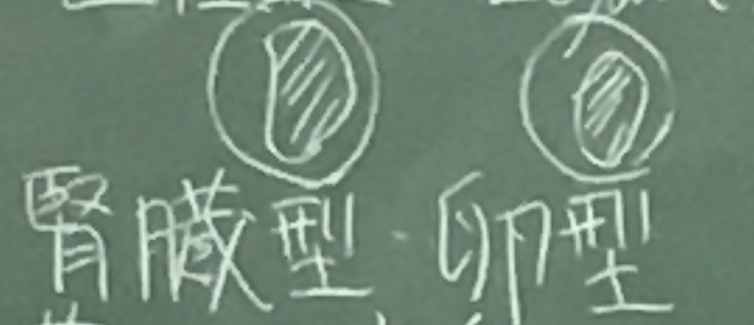

# 血液と造血

* 血液：支持組織の一種
* 要点：各血球の特徴と役割


## 末梢血の細胞の種類と機能

### 赤血球
#### 概要

* 中央部が陥凹した円盤状
* 無核
* 直径7〜8μm
* 数：400〜500万/μℓ （男性＞女性）
* 寿命：120日
* 循環血中のみに存在（通常血管外、組織中にはいない）
* 老化した赤血球：貪食または溶血によって破壊（脾臓で）
* 赤血球は血液中で網状性赤血球と入れ替わる

#### 機能

* O2とCO2の輸送

#### 構造

* 細胞骨格（アクチンとスペクトリン）と膜タンパク（バンド３など）が細胞膜を裏打ちする　（参考：プリント#9）


### 白血球

* ２種類に大別：　合計数 3300〜10000個/μℓ
	* 顆粒球：　細胞室にアズール（１次）顆粒・特殊（２次）顆粒を持つ
		* アズール→青く染まる
	* 無顆粒球：　１次顆粒を持つがよくみえない

#### アズール顆粒　　骨髄
* 殺菌性タンパク（ミエロペルオキシダーゼ、ディフェンシン、リゾチーム等）をもつ
	* 細胞内に取り込んだ細菌の殺菌に重要
	* ミエロペルオキシダーゼ：　H2O2 + 2Cl- → 2HOCL （次亜塩素酸）→ 殺菌

#### 特殊顆粒
* ラクトフェリン・リゾチーム等を持つ
	* ラクトフェリン：Feイオンに結合→細菌の増殖減
* 細胞外に放出されることが多く、炎症の開始に重要

#### 顆粒球

* 核：　分葉
* 直径：　12〜15μm
* 種類：　３つ（好中球、好酸球、好塩基球）
* 数・機能：　プリント#11を参照


> 血球の比率はテストで出題するので覚えること（先生）

#### 無顆粒球

* 2種類（リンパ球、単球）

| --- | リンパ球 | 単球 |
| :---: | :---: | ---: |
| 大きさ | 大小２種類　・大：9-12μm 3% ・小：6-8μm 97% | 直径 12~20μm |
| 核 | 丸くやや凹む | 腎臓型、卵型 |
| 細胞質 | 好塩基性 | 薄い灰青色 |
| 顆粒 | まれにアズール顆粒＋ | みえない（小さい） |
| 空胞 | なし | よくみられる |
| 寿命 | 数週〜数年 | 血液中で数日・組織中で数日〜数年 |
| 機能 | 液性免疫（Bリンパ球）、細胞生免疫（Tリンパ球） | 組織中でマクロファージに分化　→ 死んだ細胞・細菌の貪食・抗原提示 |



### 血小板

* 直径：　2〜4μm
* 形：　　碁石状・無核
* 数：　　15〜40万個/μℓ血液
* 寿命：　8〜10日
* 機能：　血液凝固の促進、血液漏出の防止
* 分化：　骨髄の巨核球の細胞質が断片化して血小板になる
* 構造：　細胞膜は内側に陥入して開放細胞系を作る
	* 中央部：　顆粒部（ミトコンドリア、小胞体、ゴルジ体、顆粒）
	* 辺縁部：　硝子部（微小管・アクチン繊維）


# 心血管系

* 要点：　動脈と毛細血管の種類
* 内皮が連続し完全に閉じた系をなす
* 目的：新鮮な血液を毛細血管床に還流すること

## 心臓

* 内皮の管を折りたたんだもの
* ３層から成る
	* 心内膜：　内皮層＋内皮下結合組織
	* 心筋層：　心房筋・心室筋（固有心筋）、特殊伝導心筋繊維（特殊心筋）
	* 心外膜：　中皮が覆う

### 心臓の刺激伝導系

洞房結節 → 心房筋（固有心筋）→ 房室結節（田原結節） → ヒス束（房室束）　→ 右脚、左脚 → 心室全体

* 洞房結節：　右心房にある（ペースメーカー）、興奮を発生し収縮リズムを作る
* ヒス束→右脚・左脚：　刺激を伝導する特殊心筋　＝　プルキンエ繊維
* 特殊繊維
	* 筋原繊維が少ないが、横紋はあり。
	* 繊維が太い
	* グリコーゲンが豊富

* 内分泌作用あり（心房筋肉）
	* 血液量↑ → 心房筋細胞伸展 → 心房筋から心房性ナトリウム利尿因子（ANP: Atrium Na Peptitide）放出 → 腎臓での濾過↑ → 尿量↑（ナトリウム排泄↑） → 血液量↓ → 心房筋の伸展↓

> 臨床：ANPが心不全のマーカーとなる

## 動脈と静脈
* 動脈：圧高い（血圧を送るため）、壁厚い
* 静脈：圧低い、壁薄い

### 動脈
３つの膜（内膜、中膜、外膜）から成る

1. 内膜：　内皮層、内皮下層（疎性結合組織）、内弾性板（弾性繊維）
1. 中膜：　膠原繊維＋弾性繊維
1. 外膜：　主に結合組織から成る

### 心臓・毛細血管の間の動脈
* ３種類：　上から直径が大→小
	1. 弾性型動脈　・・・　ii.に心臓からの血液を送る「搬送動脈」
		* 心臓からの血液を高圧で受ける
		* 心臓からの血圧差の大きな拍動を血圧差の少ない形で循環させる
		* 例）大動脈、肺動脈、鎖骨下動脈、総頸動脈、総腸骨動脈など
		* 構造：　中膜の弾性繊維が多い（平滑筋少ない）、内・外弾性板の発達悪い
	1. 筋型動脈　・・・　「分配動脈」
		* 平滑筋が収縮して径が変化する → 各機関の要求に応じて血液を配分する
		* 例）大動脈・肺動脈から分岐する動脈の多く：　上腕動脈、大腿、ぎょう骨、膝窩動脈など
		* 構造：　中膜の弾性繊維少ない（平滑筋多い）、内外弾性板の発達良い
		* 1から2の移行型あり
			* 1から2の移行領域
			* 例）外頸、膝窩、総腸骨動脈など
			* 構造：　中膜に島状の平滑筋繊維がある
	1. 小動脈と細動脈　・・・　細動脈「抵抗血管」：体循環血圧の主な決定要因
		* 筋型動脈　→ 分岐　→ 小動脈　→ 分岐　→ 細動脈
		* 動脈壁の平滑筋の収縮と拡張によって毛細血管への血流配分を制御
		* 直径：　細動脈は300μm以下
		* 内膜：　内皮＋うすい内皮下層（2と同じ）
		* 中膜：　平滑筋層は2よりも薄い

### 毛細血管
基底板で囲まれた１層の透過性の高い内皮細胞からなる極めて細い管

* 直径：　5-10μm、薄さ：　0.5μm → ガス拡散可能
* ３つの型がある：連続型、有窓型、不連続型

> 毎年テストに出題している 

| --- | 連続型 | 有窓型 | 不連続型 |
| :---: | :--- | :--- | :--- |
| 孔 | なし | あり（φ10-100nm） | あり（大きい） |
| 孔の隔膜 | なし | あったりなかったり | なし |
| 物質の移動 | トランスサイトーシス | 孔 | 孔 |
| 基底板 | 連続 | 連続 | 不連続 |
| 器官 | 脳、肺、筋、骨など | 液体の移動の多い組織、腸、脈絡叢など | 肝、脾など |


> 通過することをトランスサイトーシスと呼ぶ

### 静脈

* 特徴：　壁、動脈より薄い
* 収容される血液量：　動脈より多い
* 層構造：　動脈と大体同じだが、内〜外膜の境界は不鮮明
    * 内膜：　内皮（内弾性板なし）
    * 中膜：　うすい輪状の平滑筋線維
    * 外膜：　疎性結合組織
* 弁があり血液の逆流を防いでいる


### リンパ管

* 毛細リンパ管
	* １層の内皮細胞からなる
	* 毛細血管の近くから盲端で始まる
	* 毛細血管から漏出した血漿成分（組織液） = リンパを集める（１日２〜３ℓ）
		* リンパ：　蛋白質や大きな分子が進入する
	* 多くの組織にみられる（例外：　軟骨、骨、上皮、中枢神経系など）
* （より大きな）リンパ管
	* ３層構造：　内、中、外膜
	* 弁がある
	* 経路：　毛細リンパ管　→ リンパ管　→ （右上半身）右リンパ本幹　→ 血液
		* それ以外は、胸管　→ 血液


# 舌・歯　（消化器の特殊な構造）

```
要点：　発生中と完成時の各細胞の名称・形態・機能

```

標本の作り方は骨と同じ

* 研磨標本　・・・　プリント#7, #8
* 脱灰標本　・・・　プリント#4, #5

構造


発生の流れ


* 象牙質
	* 骨の一種
	* 象牙細管の中にトームスの線維を入れる
	* 象牙質　＝　膠原線維（象牙細管を取り巻くように走る）　＋　基質（リン酸カルシウム）
	* 石灰化は球状におこる　＝　石灰化球　基質小胞
* エナメル質
	* 人体組織の中で最も硬い：　高度に石灰化
	* エナメル小柱とその間の小柱間質から成る
	* エナメル芽細胞１個が小柱一本を形成
* 歯の成長線
	* エナメル小柱の石灰化が低い横紋からできる線　＝　レチウスの線条
	* 象牙質の成長「アンドレーゼンの線条」
* セメント質
	* 歯根の象牙質を包むうすい骨質の層
	* 歯が生え出すころに完成、歯を顎に固定するため
	* 歯の完成後も逐次追加される
* 歯髄
	* 最表層に象牙芽細胞が並ぶ。その内側は歯髄細胞（線維芽細胞）、膠原・細網線維が豊富
	
