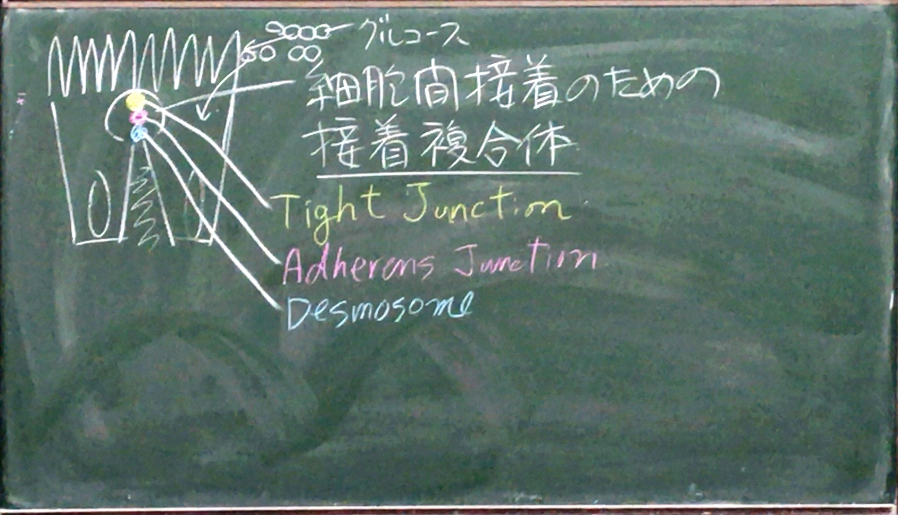
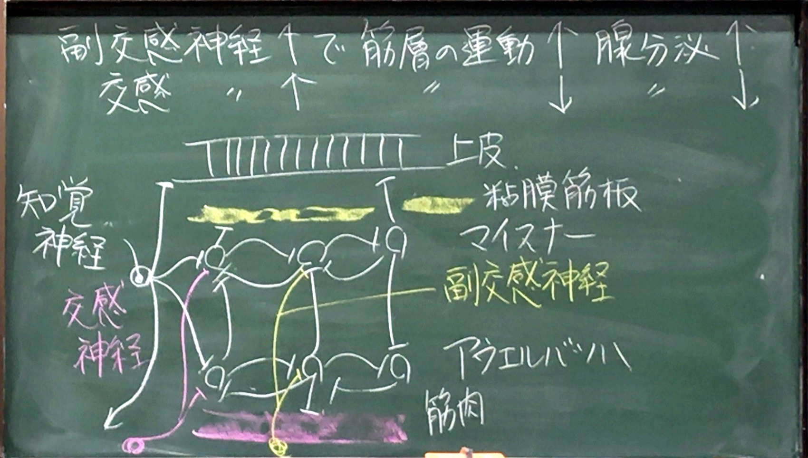
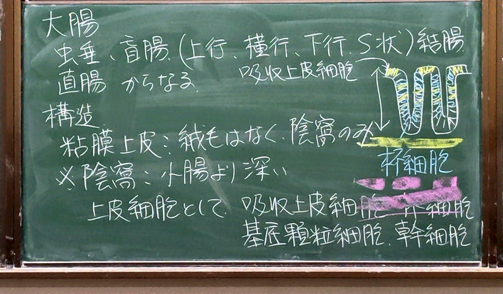

# 小腸・大腸

> 要点：
> 小腸：①全体の構造、②各細胞（特に吸収上皮細胞）の形と機能
> 大腸：小腸との構造の違い

## 小腸

* 主な機能：　①栄養の吸収、②消化
* 肉眼的には３つに分けられる。（空腸と回腸に明確な境界はなし）
    * 十二指腸：　長さ25cmくらい。幽門に続く部位。中程に膵管・総胆管が開口。
    * 空腸：　　　十二指腸が腹腔内から現れると空腸になる。
    * 回腸：　　　空腸の続き。

小腸（十二指腸、空腸、回腸）の基本構造

* 絨毛：長さが約1mmの突起。絨毛が粘膜深く入ったものが陰窩
    * 部位による違い
    * 形：胃から大腸に方向につれて、長い・広い・密　→ 短い・狭い・疎
    * 輪状ヒダ：　十二指腸で出現　→ 十二指腸〜空腸の移行部で明瞭　→ だんだん小さくなり回腸中間部で消失

絨毛の基本構造

### 絨毛の細胞について

* 多くの吸収上皮細胞 ＋ 少数の杯細胞

#### ①吸収上皮細胞

* 核：　　　細長く、基底部に偏在する
* 細胞質：　エオジンでピンクに染まり、上端1〜1.5μmはやや強く染まる。
* 「刷子縁」brush border = 微絨毛の集合

##### 微絨毛の構造
* 長さ：0.5~1.5μm、太さ：80nm
* １つの細胞に約1000~3000本生える

微絨毛の構造

##### 微絨毛の役割

1. 腸の吸収面積を増やす
	* 輪状ヒダ＋絨毛＋微絨毛により、20〜30m2になる
1. 消化の場：
	* 微生物に栄養をとられないようにするため、微絨毛はタンパク・糖の分解酵素の膜内酵素を含む
		* タンパク質（ペプチド鎖）  
		↓ 膵液中のトリプシンなど
		* オリゴペプチド（数個）  
		↓ 微絨毛の蛋白質分解酵素（アミノペプチダーゼなど）
		* ジペプチド・トリペプチド・アミノ酸  
		↓ Na+と共に共輸送チャンネルを通って細胞内に入る  
		↓ 細胞内ペプチダーゼ
		* アミノ酸  
		↓ 血中に輸送

##### 脂肪の吸収

* 脂肪　→（酵素）→ 脂肪酸＋モノグリセリド　（細胞膜を拡散によって通過）

#### ②杯細胞

* 吸収上皮細胞の間に散在する粘液分泌細胞
* 核：　小さい、基底部に濃縮
* 細胞質：　上部が粘液で丸く膨らむ

### 陰窩の細胞

パネート細胞、基底顆粒細胞、幹細胞がある

1. パネート細胞

	* 陰窩の底部にあるピラミッド型の細胞
	* 寿命：　　約20日
	* 核：　　　丸い、基底部に局在
	* 細胞質：　Apical部に多数の顆粒（エオジンで赤く染まる）
		* リゾチーム・ディフェンシンなど
		* 微生物から上皮の管腔面を保護する物質を分泌
	* 役割：　　１．抗菌物質の分泌、2. 幹細胞の維持

1. 基底顆粒細胞 = 腸内分泌細胞（クロム親和性細胞）

	* 色んな消化管ホルモン（大半がセロトニン）を分泌　→ 消化器系の機能を調節

1. 幹細胞

	* 自己複製
	* 絨毛・陰窩の全ての種類の細胞に分化できる細胞
	* パネート細胞の間にある細長い細胞

##### 上皮の増殖と移動について

* 陰窩の中の幹細胞が分裂　（分裂像がよく見える）  
→ 絨毛の表面を上方に移動（分化しながら）  
→ 絨毛の先端部から脱落

> 参考：大便中に水分60%, 上皮細胞 15-20%, 細菌10-15%, 食物繊維5%

##### 上皮の下の各層について

* 粘膜固有層：
	* 細網繊維、遊走細胞（リンパ球、形質細胞、好酸球）が多い
	* リンパ管：　太い。絨毛の真ん中を「中心乳糜腔（にゅうびこう）」が走り、吸収された脂肪が通る。
* 粘膜筋板：　陰窩のすぐ下を走る
* 粘膜下組織：　
	* 疎性結合組織。弾性線維多い。
	* 大小の血管、リンパ管が多い。
	* マイスネルの粘膜下神経叢がある。→ここから出た神経が粘膜下層・固有層に分布
* 筋層：　典型的な内輪外縦
	* 筋層間にアウエルバッハの筋間神経叢が点在

###### 腸神経叢について

* 互いに連結する２つの神経叢からなる
* 神経細胞の軸索が分岐して網目を形成し、他の神経細胞とつながったもの
* 自律性が高い
* 機能：　消化管が、①内部の局所刺激　②外部の自律神経からの刺激　の両方に対応し、腸の筋層、粘膜筋板の運動、腺の分泌を調節するためのもの
* 副交感神経↑で筋層の運動↑、腺分泌↑
* 交感神経↑で、筋層の運動↓、腺分泌↓

#### 部位特異的な構造（十二指腸腺とパイエル板）

1. 十二指腸腺 = ブルンネル腺 Brunner's glnad
	
	* 粘液腺
	* 十二指腸の胃に近い部位の粘膜下組織にある
	* アルカリ性の粘液を産生　→ 胃からの産生の食物の消化物を中和

1. パイエル板について

	* 腸粘膜や粘膜下組織にみられる特殊化した多数のリンパ小節の集団。
	* 消化管（腸）関連リンパ組織の一種 GALT: Gut-associated lymphoid tissue
	* 局在：　回腸に多い
	* 特徴：　表面に絨毛が少ない　＋　細かい凹凸を示す
	* 構造： （イラスト#22） 
		* 上皮：　濾胞関連上皮（FAE: follide-associated epihtelium）によって覆われる　＝　吸収上皮細胞　＋　M細胞
		* 上皮の下層：　２つから成る。T細胞と抗原提示細胞を含む
			1. ドーム部分：　胚中心と上皮の間
			2. 胚中心：　IgA陽性B細胞

##### 免疫による腸管保護機構

* 小腸は内腔面が広いため、微生物や抗原に侵されやすい　→ それらに対する防衛が必要。　「監視」と「実行」の２つからなる。
	* 監視：　消化管内に出現する抗原を監視する機構　＝　パイエル板
	* 実行：　抗原を中和して防衛する機構　→ B細胞（形質細胞）が分泌するIgA

##### 監視のメカニズム
* 抗原をプロテアーゼ（カテプシンE）含有顆粒に取り込む。  
→ ApicalからBasolateralへのトランスサイトーシスで輸送  
→ 抗原提示細胞（APC）に提示  
→ T細胞の活性化  
→ B細胞の活性化  
→ IgA分泌 

資料No.3 #22, #24も参照

##### 実行（= IgA分泌）のメカニズム
* 絨毛の粘膜固有層のB細胞（形質細胞）がIgAを二量体分子として、粘膜固有層に分泌  
↓ 吸収上皮細胞のBasolateral側に発現するPoly-Ig受容体に結合  
↓ IgA + poly-Ig受容体の複合体はBasolateral → Apicalへのトランスサイトーシスで輸送される  
↓ 吸収上皮細胞のApical表面でPoly-Ig受容体が酵素で切られ、IgA + poly-Ig受容体の一部が腸管管腔に放出される。  
↓ 抗原の中和

## 大腸

虫垂・盲腸・（上行、横行、下行、S状）結腸、直腸

* 構造：
	* 粘膜上皮：　絨毛はなく陰窩のみ。（小腸より深い）
		* 上皮細胞として、吸収上皮細胞、杯細胞、基底顆粒細胞、幹細胞
			* 吸収上皮細胞：　陰窩の壁と粘膜表層を覆う。
				* 小腸の吸収上皮細胞より、微絨毛も短く少ない。（長さ約半分 0.5μmくらい）
				* 吸収するもの：　
					* 大量の水と電解質（Na+, K+, Cl-）
					* 短鎖脂肪酸（酢酸など）・・・腸内細菌による分解によって生じる。１日に約100KCaを得る。
			* 杯細胞：　陰窩の側壁に多い　→ 粘膜分泌が盛ん
			* 基底顆粒細胞、幹細胞はあるがHEでは見えない、基底顆粒細胞かなり多い
	* 粘膜筋板：　陰窩の底に沿って走る
	* 固有層・粘膜下組織：　構築は小腸と同じ、＋孤立リンパ小節が多数散在
	* 筋層：　内輪外縦で小腸より厚い

### 各論

#### 虫垂

* 小指くらいの大きさ
* 内腔ごく狭く、たまに閉鎖
* 上皮は他の大腸より杯細胞が少ない
* 粘膜固有層と粘膜下組織の上部に浸潤したリンパ球やリンパ小節が多い　→ 一種の集合リンパ小節

#### 直腸

* 腸管の終末部
* ２つの部位からなる：　上部直腸と下部直腸（肛門管）
* 特徴：　粘膜厚く、静脈発達　→ 痔静脈の網、うっ血・破裂・感染によって「痔」になる
* 陰窩が長くほとんど杯細胞で覆われる
* 肛門管で陰窩が徐々になくなる　→ 重層扁平上皮（非角化）　→ 角化して皮膚に移行