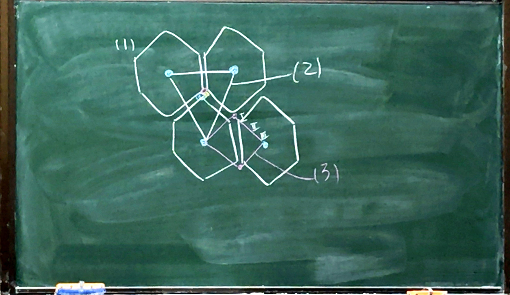
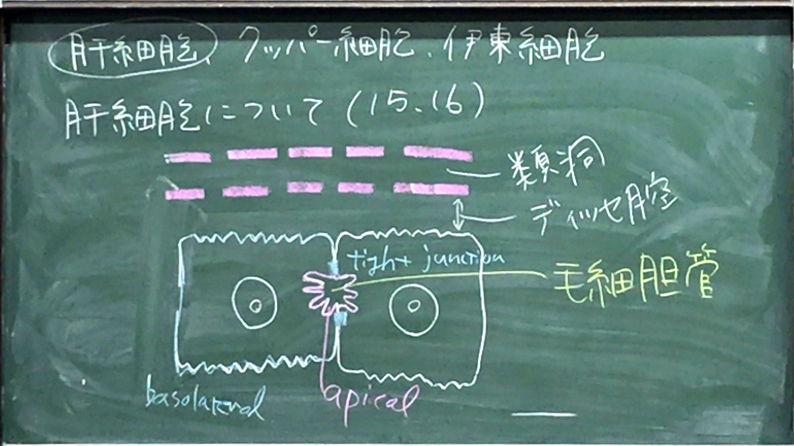

# 肝臓

* 機能: 胆汁分泌、栄養の貯蔵、代謝、解毒、血球の破壊
* 表面はほとんど漿膜に覆われ、その下に膠原線維、弾性線維の結合組織（＝**グリソン嚢**）  
→その続きが肝臓内に入り込み小葉間結合組織（**グリソン鞘**）となって肝の実質を無数の肝小葉に分ける。（プリント #2）

### 肝小葉

* 肝臓の構造上・機能上の単位　径0.5〜2mm、高さ: 0.5〜2mmの六角形/多角形
* 中心静脈を囲んで、肝細胞が放射状に配列　→ 肝細胞索（板）
* 胆汁：  肝細胞と肝細胞の間の毛細胆管によって遠心性に流れる
* 血液：　肝細胞索の間の空隙を洞様毛細血管（類洞）によって求心性に流れる。
* 小葉間動脈：　壁厚く、管腔狭い、血液量 20〜25%
* 小葉間静脈：　壁薄く、管腔広い、門脈（血液量の75〜80%）
* 小葉間胆管：　単層立方上皮で構成される毛細胆管に由来

肝小葉について（プリントNo.1 #2,3,5）

> 三つ組構造はプリント#4を参照

> ここの流れは勉強しといたほうがよいかもしれません。
> ここの血管、胆管の走行は重要かもしれません。
> ちなみに私は去年の問題は作成していません。（先生）

### 血管系

* 小葉間動脈：　　動脈血で酸素が多い
* 小葉間静脈：　　腸管からの栄養に富む。類洞に入ると小葉間動脈と混ざる。
* 類洞 → 中心静脈　→ 小葉下静脈　→ 肝静脈　→ 下大静脈（参照：プリントNo.1 #11）

#### 洞様毛細血管について

* 一般の毛細血管より太い
* 肝細胞索と毛細血管内皮の間　＝　ディッセ腔
* 血管内皮に大小の窓が多数開いている。血漿がこの間を通って肝細胞に触れる。  
→ 血漿中のアミノ酸、グルコース、ビタミンなどを細胞内に取り込む。

> 洞様毛細血管は、 ~~今のところ有窓型で良い。あとで調べておく。~~ →不連続型。（先生）

### 胆道系

* 胆汁：　肝細胞で産生　→ 毛細胆管　→ **ヘリング管**　→ 小葉間胆管　→左肝管/右肝管　→ 総肝管（⇄ 胆嚢管　⇄ 胆囊）→ 総胆管 → 十二指腸

> プリントNo.1 #5, #11

> 覚え方：　小葉間のヘリにあるからヘリング管。

### 肝小葉の分類
参照：プリントNo.2 #13

1. 古典的肝小葉：　　中心静脈に類洞が収束する六角形
1. 門脈小葉：　　　　３つ組が中心
1. 肝腺房：　　　　　細動脈の終末枝によって決定。

|---|一帯|二帯|三帯|
|:--|:--|:--|:--|
|酸素と養分|多い|中間|少ない|

> 肝硬変において重要。酸素や養分が少ないため、三帯から傷害を受けやすい。

### 肝細胞、クッパー細胞、伊東細胞

#### 肝細胞について（プリントNo.2 #15, #16）

* 直径：　15〜30mm
* 消化管の上皮が落ち込んで増殖・分化
* HE染色で淡赤色　中央に丸く大きな核が１〜２個。核小体明瞭。
* グリコーゲン顆粒、脂肪滴が見られる
* ２つの肝細胞の境界線の中央に毛細胆管
* 内分泌と外分泌を行う上皮細胞　→ apical, basolateralに分けられる
    * apical（→外分泌）　: 毛細胆管に面する。微絨毛あり。両側にtight junctionがあり、胆汁の漏出を防ぐ。
    * basolateral（→内分泌） : ディッセ腔に向かう微絨毛あり。血液由来物質の取り込み。血漿タンパク質（アルブミン、フィブリノゲン、プロトロンビン、凝固因子）の分泌

> 他の細胞とつながっていたらそこがApicalになる

##### 肝細胞内の細胞内小器官（プリント#21, #22）

* 粗面小胞体：　高度に発達、血漿タンパクの合成
* 滑面小胞体：　高度に発達、グリコーゲン分解。脂質合成（コレステロール、胆汁酸など）
* ペルオキシゾーム：　H2O2を生成するオキシダーゼを多く含む。脂質合成に関与。

#### クッパー細胞（プリント#10）

* 血管内皮のところどころに存在。星形に突起を出す。
* 大食細胞の一種（プリント#27, #28, #30が取り込んでいる様子）

#### 伊東細胞

* ディッセ腔に存在
* 平常時：　脂肪の貯蔵、ビタミンA貯蔵、代謝
* 病的：　コラーゲン線維産生細胞になる。

> 群馬大学では伊東細胞の漢字を間違うと留年という噂。

##### 脂肪肝、アルコール性肝炎（プリント#31）

* エタノール、ウイルス、毒素の肝臓への侵入  
→ クッパー細胞：　TNF-α、TGF-βの産生↑  
→ TNF-αは炎症細胞を引き入れる（→炎症）  
→ TGF-βが伊東細胞のコラーゲン産生↑  
→ ディッセ腔にコラーゲン蓄積（線維化）  
→ 内皮細胞の窓が減る

> コラーゲンが窓を塞ぐ感じ。肝硬変になり、食道静脈瘤などを引き起こす。 

#### 胆汁について（プリント #34）

* ４つの機能
    * 脂質（コレステロール、リン脂質、胆汁酸）、抱合ビリルビン、電解質排出
    * 腸管内での脂肪吸収に関与
    * IgAを腸粘膜に輸送
    * 薬物代謝産物・重金属の排出
* 組成
    * 有機成分：　胆汁酸、コレステロール、リン脂質
    * 無機成分：　Na, Cl

##### 胆汁酸

コレステロールを排出するための主な機構

* 一次胆汁酸：　コレステロールから合成される
* 二次胆汁酸：　一次胆汁酸から腸内細菌によって作られる

##### 胆汁の流れ

* 十二指腸への流れ：　オッディの括約筋で調節
* 腸管内の脂質に反応して十二指腸の内分泌細胞からコレシストキニンが分泌される  
→ 胆囊の筋層収縮　＋　オッディの括約筋弛緩  
→ 胆汁が十二指腸へ

> 腹部エコーで空腹時だと胆囊が丸くよく見えるが、食事後だとあまり見えない。（先生）

> →ポカリスエットなども検査時に飲んではいかないのか。

> →腸の蠕動運動などでもCCKが出てしまうと思われる。（先生）

##### ビリルビン代謝（プリント No.4 #36）
* ヘモグロビン代謝産物（85%老化赤血球由来）
* 非抱合型（間接）ビリルビンが血液中でアルブミンと結合  
→ 肝細胞へ入る  
→ 滑面小胞体でグルクロン酸抱合される。　＝　抱合（直接）ビリルビン  
→ 毛細胆管で胆汁に入って十二指腸へ  
→ 小腸遠位部、結腸で非抱合ビリルビン  
→ 更にウノビリノゲン  
→ 大部分は便として排泄

> 大便の色はこのウノビリノゲンの色。これが溜まってしまうと黄疸などになる。

#### 胆囊（プリント No.4 #38〜#40）

* 役割：　胆汁貯蔵、濃縮、放出
* 構造：　粘膜（上皮、固有層）、筋層、結合組織
    * 粘膜上皮：　丈の高い単層円柱上皮、細胞質はエオジン好性、細胞表面に微絨毛
    * 粘膜固有層：　弾性線維が多い
    * 筋層：　まばらな平滑筋の束。胃腸より薄い。
    * 結合組織（漿膜）：　かなり密、各種線維、血管、リンパ管、神経が豊富

> 実習でも見ません。テストもたぶん出ません。（先生）

# 膵臓

* 構造：　唾液腺に類似（プリントNo.1 #4）
* 表面を覆う結合組織が中に入り込み、数多くの小葉に分ける。
* 各小葉は多くの外分泌腺終末部とランゲルハンス島（内分泌部）からなる。

### 外分泌終末部（腺房）（プリント #7B）

* ほぼ球形
* 外分泌腺の基本単位
* 腺房細胞と腺房中心細胞からなる

#### 腺房細胞（プリント#2, #5）

* 円柱、くさび状
* 基底部寄りの球形の核
    * 基底部：　ヘマトキシリン好性（粗面小胞体が発達しているため。）
    * 上部（apical）：　エオジン好性の分泌顆粒が多い

##### 分泌顆粒

* 細胞のapical にあって直径0.5〜1.5μm
* 中に消化酵素（トリプシノゲン、キモトリプシノゲン、リパーゼ、アミラーゼ）を含む。

#### 腺房中心細胞（プリント #2, #3, #5）

* 介在部の細胞が終末部に入り込んだもの
* 腺房細胞より小さい
* HE染色で明るく染まる
* 分泌顆粒はない

#### 介在部（プリント #3, #4, #6）

* 重炭酸イオン分泌
* 終末部と導管の間にある細い部分
* 管腔狭く、単層立方〜扁平状の細胞からなる。

#### 導管（プリント #4）

* 介在部の続き　→ 小葉内導管　→ 小葉間導管　→ 主膵管　→ 十二指腸へ

### ランゲルハンス島（内分泌部）

* 内分泌細胞（下記）と毛細血管からなる。
    * α細胞：　グルカゴン
    * β細胞：　インスリン　80%
    * δ細胞：　ソマトスタチン
    * PP細胞：　膵ポリペプチド

##### インスリンについて（プリント #17）

* 6kDaのポリペプチド
* A鎖、B鎖がジスルフィド結合で結合
* プレプロインスリン  
→ 小胞体でシグナル配列が切断  
→ プロインスリン（A+B+C）  
→ 顆粒内で、Cペプチドが切断され、インスリンになる
* 血中のグルコース濃度上昇でインスリン分泌↑ → 血糖値を下げる

> 臨床：　インスリンとCペプチドが１対１で放出されるため、インスリン測定時は、Cペプチドを計測している

##### グルカゴン

* 血糖値低下で分泌
* 血糖値を上げる

##### ソマトスタチン

* インスリン、グルカゴンの分泌抑制

##### 膵ポリペプチド

* ソマトスタチン分泌抑制
* 消化酵素の分泌抑制