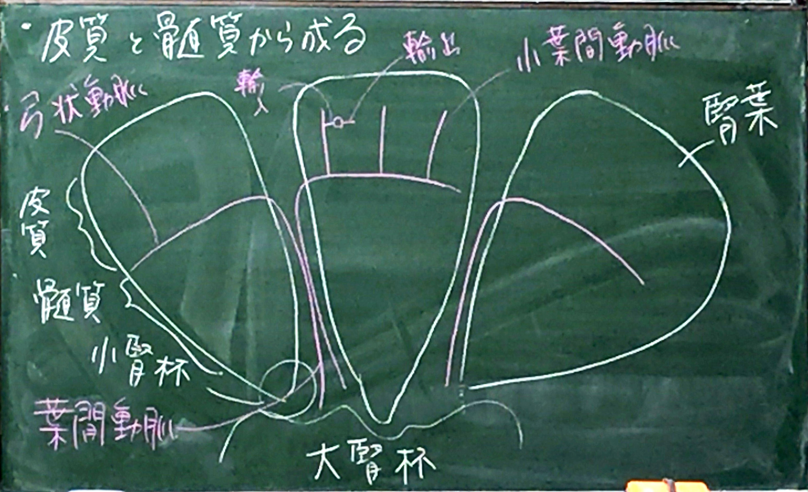
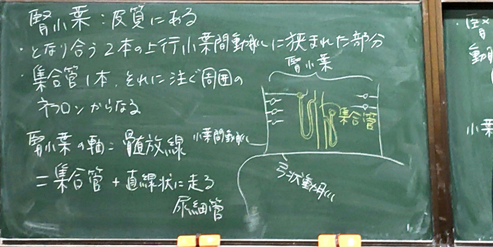
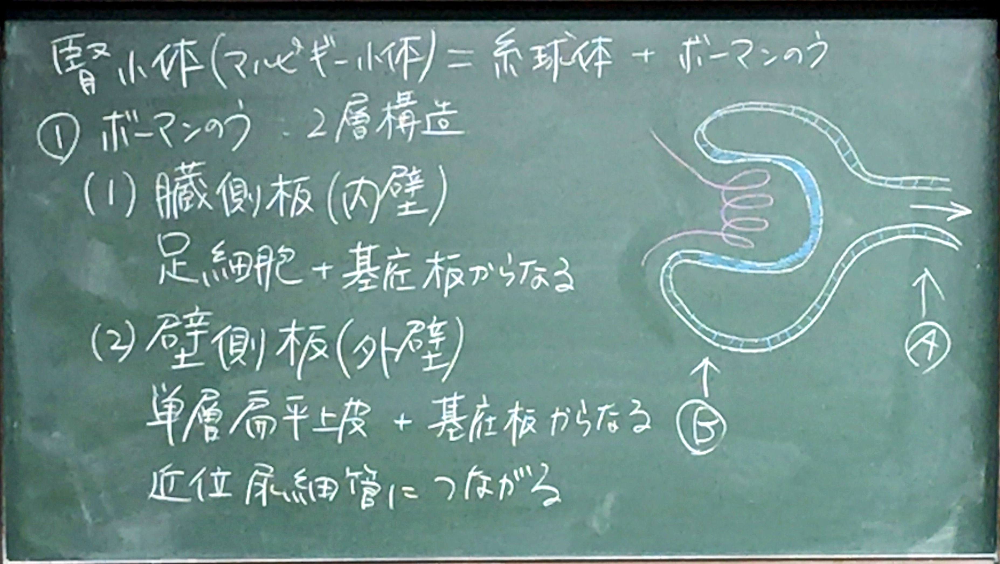
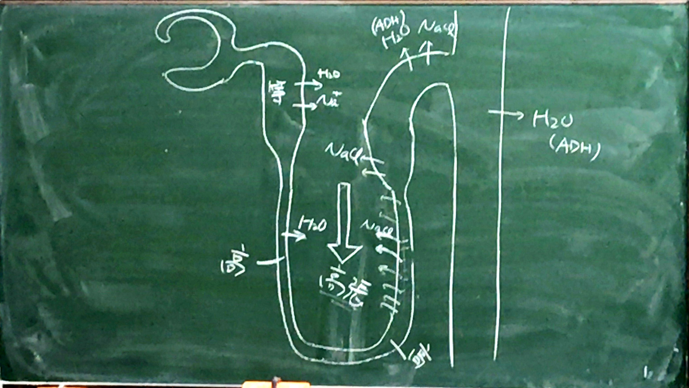

# 泌尿器系

```
要点
①腎小体の各細胞の形と役割（特に濾過における役割）
②尿細管の各細胞の形と役割
③尿の生成過程（特に対向流増幅系）
④血圧調節のメカニズム（TGF系とレニン・アンギオテンシン・アルドステロン系）
```

### 泌尿器系の機能

1. 老廃物の除去
1. 体液の電解質、酸-塩基バランスの維持
1. 血液の恒常性（ホメオスタシス）の維持
	* 小分子、イオン、水の再吸収・分泌
1. レニン（タンパク質分解酵素）分泌　→ 血圧↑
1. エリスロポエチンを分泌　→ 赤血球を増やす

### 構成

一対の腎臓　→ 一対の尿管　→ １つの膀胱　→ １つの尿道

## 腎臓

１分間に腎臓で起きること

* 血液1.25ℓ（心拍出量の約1/5）  
↓ 10%濾過
* 原尿125cc  
↓ 99%再吸収
* 尿1ml/1min（1.5ℓ/日）
	* 多尿・・・3ℓ〜
	* 乏尿・・・〜400ml

腎臓の形（プリント#2）


皮質と髄質から成る


> ○が糸球体、三角の先端部が腎乳頭。

* 弓状動脈が皮質と髄質の境界
* 髄質＝腎錐体（円錐形なので）
	* 側面：　葉間動脈
	* 底部：　弓状動脈、皮髄境界部
	* 頂部：　腎乳頭　→  腎乳頭　→ 小腎杯に囲まれる  
	小腎杯　→ 大腎杯　→ 腎盂
* 腎葉　＝　皮質と髄質

### 腎臓の血管構築

> プリントNo1 #4

* 動脈血：　腎動脈　→ 葉間動脈　→ 弓状動脈　→ 小葉間動脈　→ 腎小体へ行く
* 小葉間動脈　→ 糸球体輸入細動脈　→ 糸球体内の毛細血管網　→ 糸球体輸出細動脈  
→ 1. 表面に近い腎小体では、尿細管周囲毛細血管網  
→ 2. 深部の腎小体では直血管
* 1.2.が合わさって弓状静脈　→ 葉間静脈　→ 腎静脈

### 腎小葉

* 隣り合う２本の上行小葉間動脈に挟まれた部分
* 集合管１本、それに注ぐ周囲のネフロンからなる（プリント#5）
* 腎小葉の軸：　髄放線
＝　集合環＋直線上に走る尿細管



### 尿細管系

* １つの腎臓に約130万個

* 尿細管系
	* 集合管：　主に水分の再吸収
	* ネフロン
		* 尿細管：　水分・栄養の再吸収
		* 腎小体
			* 糸球体：　毛細血管など
			* ボーマン嚢：　濾過された液（原尿）を回収する袋

#### 腎小体（マルピギー小体）＝糸球体＋ボーマン嚢

##### ボーマン嚢

* ２層構造（プリントNo.2 #10、#12）
	1. 臓側板（内壁）：　足細胞＋基底板からなる
	1. 壁側板（外壁）：　単層扁平上皮＋基底板からなる。近位尿細管につながる
* 外壁と内壁の間：　包内腔（ボーマン腔）、糸球体で濾過された原尿を含む
* ボーマン腔には２つ極がある
	1. 尿管極：　ボーマン腔が近位尿細管と接続するところ
	1. 血管極：　尿管極の反対側。糸球体輸入出細動脈が出入りするところ



##### 糸球体

* ３つの構成要素からなる
	1. 足細胞
	1. メザンギウム細胞とそれの作るメサンギウムマトリックス
	1. 糸球体毛細血管（有窓型内皮細胞からなる）

##### 1.足細胞

* 長く分岐した突起を持ち、糸球体毛細血管の外表面を完全に取り囲む
* **糸球体濾過関門**の一部  
→ 足細胞＋（毛細血管の）内皮細胞＋その間の基底板（プリント#21, #23参照）
	1. 足細胞の末端（細胞足）
	隣の細胞足とかみ合って、基底板を覆う  
	→ 濾過スリットという隙間があり、その間をスリット膜（細隙膜）で架橋する
	1. 血管内皮：　水、尿素、グルオース、小さいタンパク質を通す
	1. 基底板：　Ⅳ型コラーゲンを含む、陰性に荷電。細かい網目を作り、大きい分子を通さない  
	→ 濾過障壁の主役

##### 2. メサンギウム細胞など

糸球体毛細血管の間に挟まれた構造。糸球体外にも存在（糸球体外メサンギウム細胞という）（プリント#16）

* 役割：
	* 毛細血管の支持
	* 貪食（糸球体・基底板の更新）
	* 収縮（毛細血管）
	* 分泌（プロスタグランジン、エンドセリン、etc）

#### 尿細管

尿細管の構成

| 走行と上皮を組み合わせた分類 | 微細形態による分類 |
| :---: | :---: |
| 近位曲尿細管 | 近位尿細管 |
| ヘンンレの太い下降脚 | 〃 |
| ヘンレのループ | 中間尿細管 |
| ヘンレの太い上行脚 | 遠位尿細管 |
| 遠位曲尿細管 | 〃 |

##### 1. 近位曲尿細管

* 原尿の再吸収：　水分、グルコース、Na+, K+, Cl-, etc
* 浸透圧は不変

形態上の特徴

* 単層立方上皮
* Apicalに微絨毛を持つ
* 基底線条を持つ　（＝中でミトコンドリアが発達　→Na+, K+の再吸収にATPが必要）

##### 2. ヘンレのループ

* 機能：　再吸収、水、Na+、K+、Cl-、Ca2+、HCO3-、etc
* 上行脚と下行脚がある
* 各脚には太い部分と細い部分がある
	* 太い下行脚：　近位直尿細管ともいう（丈の低い単層立方上皮）
	* 太い上行脚：　遠位直尿細管ともいう（丈の低い単層立方上皮）
	* 細い部分：　中間尿細管（単層扁平上皮）
* 太い上行脚のNa+/K+/Cl- cotransporter（共輸送体）が尿の濃縮と希釈に必須

##### 3. 遠位曲尿細管

* 再吸収：　Na+、Cl-、水（ADH依存性に再吸収）

形態上の特徴

1. 単層立方上皮：　近位尿細管よりも丈が低い。微絨毛の発達よくない
1. 基底陥入とその中のミトコンドリアは近位尿細管と同じくらい発達

#### 集合管

単層立方上皮：　主細胞、介在細胞

* 主細胞（明調細胞）
	* 再吸収：　Na+を再吸収、K+を排出、水の再吸収（ADH依存性）
	* 形態：　Basalに発達の悪い基底陥入とミトコンドリアあり
* 介在細胞（暗調細胞）
	* 再吸収：　K+を再吸収し、H+またはHCO3-を排出　→酸塩基平衡に重要
	* 形態：　細胞質全体に多数のミトコンドリアあり　→暗調にみえる

##### 尿の生成と排泄の過程について

* 糸球体  
↓ 原尿は等張
* 近位尿細管：　等張に再吸収
↓ 等張
* ヘンレのループの下行脚：　水の透過性高い、NaClの透過性低い  
↓ 高張（間質が高張なので）
* ヘンレのループの折り返し部  
↓ 高張
* ヘンレのループの太い上行脚：　水を透過しない、NaClは間質よりも高張なので受動的に再吸収 + **能動的にNa/K/Clをcotransporterで再吸収**  
↓ 低張
* 遠位尿細管・集合管：　NaClの再吸収とADH依存性の水再吸収  
↓ ADH+：水再吸収　→ 尿高張（尿が濃縮される）、ADH-：尿低張
* 尿



##### 対向流増幅機序

髄質の間質を高張にするメカニズム

* ヘンレのループの上行脚がNa/K/Cl cotransporterでNaを再吸収  
→ 間質が高張になる  
→ 下行脚から水を再吸収し、下行脚を高張にする  
→ 上行脚が高張になる  
→ 上行脚でNaを更に再吸収する  
→ 間質が更に高張になる  
これを繰り返すことで髄質の間質（乳頭部付近）を顕著に高張にすることができる

##### 尿細管-糸球体フィードバック機構（TFG）とレニン分泌

* 共に糸球体傍装置が担う（プリント#10, #16）

	1. 緻密斑
		* 遠位曲尿細管が糸球体の血管曲に接する部位
		* 細胞の丈が高く、核が密集
		* 尿中のCl-イオンの濃度を感知して、糸球体の血液量を調節
	1. 糸球体外メサンギウム細胞
		* 緻密斑の細胞やお互いをギャップ結合でつなぐ  
		→ 緻密斑の情報を糸球体傍装置や輸入出細動脈に伝える
	1. レニン産生細胞（糸球体傍細胞、顆粒細胞）
		* レニンを分泌
		* 輸入細動脈にある

* 緻密斑でCl-濃度を感知

	1. Cl-濃度高い（≒糸球体濾過量多い）  
	↓  
	輸入細動脈を収縮  
	↓  
	糸球体濾過量↓

	1. Cl-濃度が低いと感知  
	↓  
	レニン分泌↑  
	↓  
	レニン・アンギオテンシン・アルドステロン系↑  
	↓  
	血圧↑

##### レニン・アンギオテンシン・アルドステロン系

* アンギオテンシノーゲン（肝細胞で分泌）  
↓ レニンで切断
* アンギオテンシンⅠ  
↓ アンギオテンシン変換酵素（ACE）
* アンギオテンシンⅡ  
↓ ①血管の収縮、②ADH分泌↑ → 水の再吸収↑、③副腎皮質のアルドステロン分泌↑ → NaCl再吸収↑  
血圧↑

## 尿路

* 乳頭管　→ 腎杯　→ 腎盂　→ 尿管　→ 膀胱
* 全て内面は移行上皮で覆われる
* 上皮・固有層は平滑筋で取り囲まれる